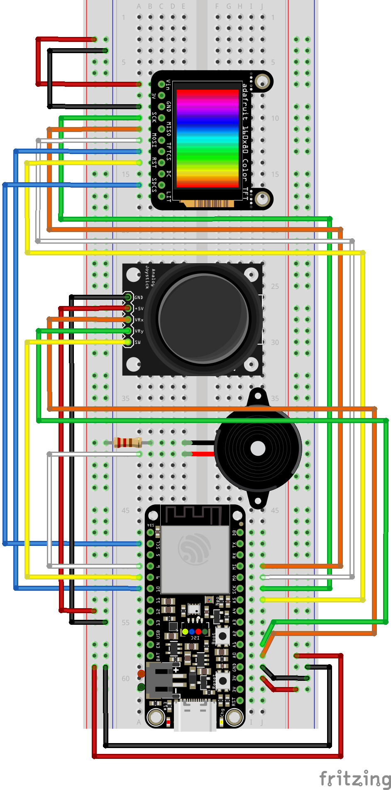

Update `\.pio\libdeps\adafruit_feather_esp32s2_tft\TFT_eSPI\User_Setup.h` to match your specifications.

# PG4501 Exam - Gaming Console

Embedded Systems gaming console software.

“Arcade game” is the first thing that comes to my mind when I read “build your own game console". 
It requires little storage, you can achieve a lot with a few pixels, and it's usually
very fun to play. 

The game is developed for the TFT screen, the SD card and the Arduino Feather ESP32-S2. 
After thorough research into what makes a good arcade game, I landed on one of the most famous, Donkey Kong.
The game is a bit of a twist on the original, as recreating it down to the smallest detail would take
too long for an exam. I have used C++ programming principles and practices to use low memory.
The journey to complete this game has been long, but I have learned a lot and am satisfied
with own results. 

_Play Donkey Kong as Mario and try to save the princess without getting crushed
of raining barrels!_

## Wiring diagram of the game console

